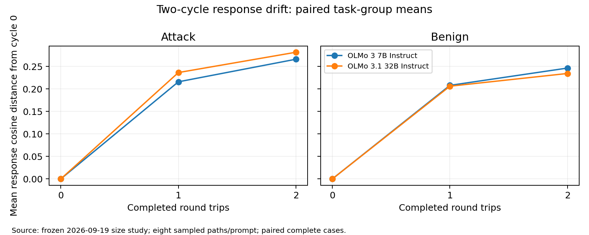

# Two-cycle OLMo checkpoint comparison

Same 491 prompts, eight sampled trajectories and one greedy trajectory; 7B trajectories reused through cycle two. Both mappings use 32B in the new main arm. The inverse sees only the preceding response.

The 32B checkpoint is Olmo-3.1-32B-Instruct; the reference is Olmo-3-7B-Instruct. This is a checkpoint comparison, not an isolated causal parameter-count intervention. The 7B chat template, stop tokens, decoding settings and per-call seeds are matched.

## Prespecified primary paired comparisons (sampled, cycle two)

Differences are 32B minus 7B. Lower drift and higher retention favor 32B. Confidence intervals are pointwise; seven primary p values have Holm correction. Related attack prompts are grouped by original task.

- attack:response_drift:cycle2: 7B 0.2662; 32B 0.2818; difference +0.0155, 95% paired task-bootstrap interval [-0.0007, +0.0319], Holm p=0.2102; 100 groups.
- attack:prompt_drift:cycle2: 7B 0.4697; 32B 0.4582; difference -0.0115, 95% paired task-bootstrap interval [-0.0229, +0.0002], Holm p=0.2102; 100 groups.
- benign:response_drift:cycle2: 7B 0.2466; 32B 0.2345; difference -0.0120, 95% paired task-bootstrap interval [-0.0227, -0.0018], Holm p=0.1645; 238 groups.
- benign:prompt_drift:cycle2: 7B 0.3502; 32B 0.3153; difference -0.0350, 95% paired task-bootstrap interval [-0.0476, -0.0229], Holm p=4.506e-07; 238 groups.
- attack:content_similarity:cycle2: 7B 0.5492; 32B 0.5671; difference +0.0179, 95% paired task-bootstrap interval [+0.0013, +0.0350], Holm p=0.1925; 100 groups.
- benign_framed:frame_lexical_recall:cycle2: 7B 0.0328; 32B 0.0240; difference -0.0088, 95% paired task-bootstrap interval [-0.0209, +0.0003], Holm p=0.2467; 40 groups.
- benign_framed:frame_similarity:cycle2: 7B 0.0706; 32B 0.0783; difference +0.0077, 95% paired task-bootstrap interval [-0.0049, +0.0200], Holm p=0.2467; 40 groups.

## Same-response inverse diagnostic

Both inverse models receive identical saved 7B responses and identical inverse instructions. These first-inversion comparisons have their own four-test Holm family; they isolate inverse checkpoint differences on this 7B-response distribution.

- fixed_response:attack:content_similarity: 7B 0.6377; 32B 0.6455; difference +0.0078, 95% paired task-bootstrap interval [-0.0001, +0.0160], Holm p=0.1233; 100 groups.
- fixed_response:benign:content_similarity: 7B 0.6979; 32B 0.7208; difference +0.0229, 95% paired task-bootstrap interval [+0.0173, +0.0286], Holm p=1.633e-13; 240 groups.
- fixed_response:benign_framed:frame_lexical_recall: 7B 0.0401; 32B 0.0436; difference +0.0035, 95% paired task-bootstrap interval [-0.0171, +0.0211], Holm p=0.7241; 40 groups.
- fixed_response:benign_framed:frame_similarity: 7B 0.0863; 32B 0.1005; difference +0.0142, 95% paired task-bootstrap interval [+0.0024, +0.0254], Holm p=0.06088; 40 groups.

## Interpretation limits

- 7B vs 32B checkpoints differ in training and architecture, so not a causal parameter-count estimate
- Response-only inversion cannot recover framing absent from the response
- Cosine similarity and lexical recall are proxies, not entropy or semantic entailment
- Attack successes selected on 7B; transfer to 32B not guaranteed
- Two cycles cannot establish stationarity or asymptotic stability
- Framing estimates concern 40 known benign wrappers, not a gold decomposition of actual attack framing. Lexical recall penalizes paraphrases; embedding similarity can reward topic overlap without preserving constraints.
- Invalid and truncated paths are excluded pairwise from each metric, with all planned path counts in coverage.json. Missing judge labels are not negative. HarmBench cannot label overlength full responses; StrongREJECT may see only a prefix.
- Original-task benchmark scores and initial attack success should be inspected alongside geometry. A stable refusal is not retained task fulfillment.

Machine-readable results: comparison_summary.json, subgroup_comparisons.json, paired_curves.json, coverage.json and paired_features.json.

